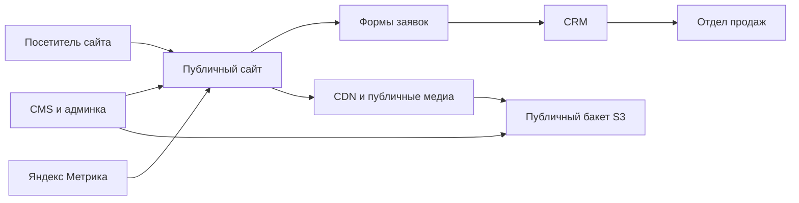
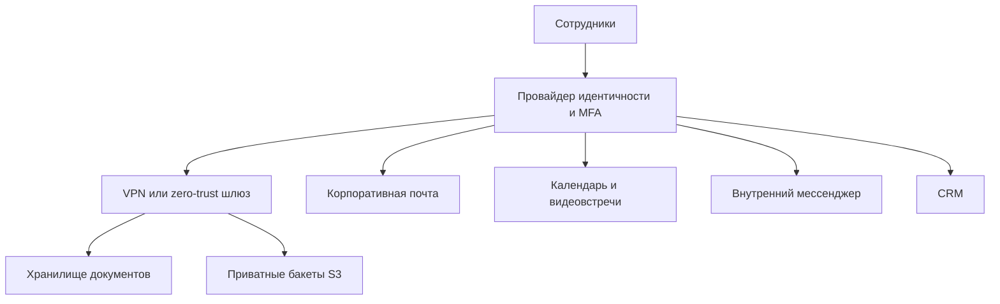
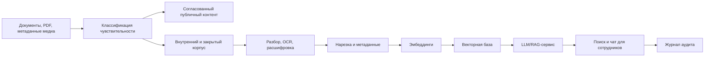

# Архитектура инфраструктуры

**Русский** · [English](infrastructure_architecture.en.md)

## Фаза 1. Публичный сайт и основа контента

Рекомендованная первая версия:

- публичный сайт: оставить WordPress только если нужны быстрые правки, иначе
  пересобрать как структурированный каталог с фронтендом и CMS;
- медиа: S3-совместимое объектное хранилище с CDN;
- аналитика: Яндекс Метрика с первого дня;
- формы: отправка заявок в CRM с резервной отправкой на почту;
- SEO: чистые метаданные, разметка изделий, карта сайта, мультиязычные маршруты.

## Фаза 2. Корпоративный контур на 60 сотрудников

Ключевой принцип: одна система идентичности, строгая MFA, ролевой доступ и
чёткое разделение публичных и закрытых документов до того, как их начнёт
поглощать ИИ.

## Фаза 3. AI-платформа знаний

Предлагаемые компоненты:

- объектное хранилище: Yandex Object Storage или другой S3-совместимый провайдер;
- база данных: PostgreSQL под структурированные данные приложения;
- векторная база: pgvector для MVP, Qdrant если поиск вырастет;
- очередь: Redis или RabbitMQ под задачи загрузки и индексации;
- ИИ: начинать с управляемых API YandexGPT и VLM там, где это допустимо;
  чувствительные нагрузки переносить на приватные GPU-машины только после
  классификации данных и проверки стоимости;
- наблюдаемость: логи, метрики, проверки доступности, мониторинг бэкапов.

## Окружения

- `prod` — публичный сайт, CRM, согласованные публичные документы, стабильные
  ИИ-сервисы;
- `staging` — предпросмотр изменений сайта и контента, интеграции CRM и форм;
- `internal` — внутренние инструменты знаний и работа с документами;
- `lab` — эксперименты с GPU и VLM на синтетических или согласованных
  нечувствительных данных.

## Базовые требования безопасности

- MFA для всех учётных записей сотрудников.
- Группы доступа по принципу наименьших прав.
- Приватные бакеты по умолчанию.
- Подписанные ссылки для закрытых файлов.
- Раздельные конвейеры публичных и внутренних документов.
- Бэкапы базы, CMS, выгрузки CRM и метаданных объектного хранилища.
- Журналы аудита по доступу к чувствительным документам и запросам к ИИ.
- Явное согласование публикации до того, как документ станет публичным.

## Открытые вопросы по архитектуре

- Яндекс, Google или Контур как основной офисный, идентификационный и
  коммуникационный стек.
- Должна ли медицинская и регуляторная документация целиком оставаться внутри
  российской инфраструктуры.
- Какая нужна CRM: Bitrix24, amoCRM, процесс на Яндекс Трекере, инструменты
  Контура или собственная CRM.
- Точный бюджет и сроки по GPU-машинам.
- Требуемые доступность и SLA для публичного сайта и внутренних сервисов.
