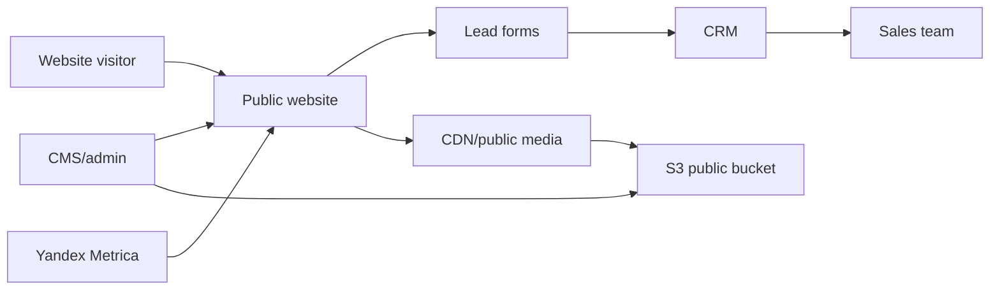
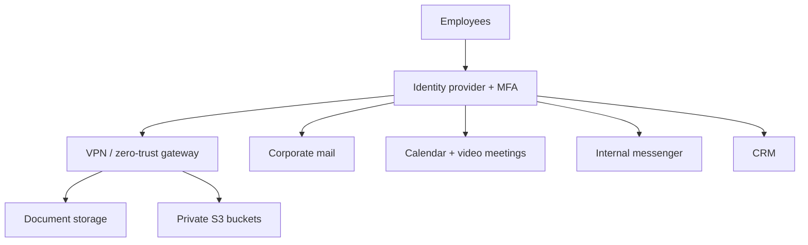
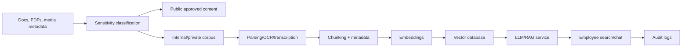

# Infrastructure Architecture

## Phase 1: Public Site And Content Foundation

Recommended first version:

- Public site: preserve existing WordPress only if rapid edits are required; otherwise rebuild as a structured catalog frontend with CMS.
- Media: S3-compatible object storage with CDN.
- Analytics: Yandex Metrica from day one.
- Forms: send leads into CRM and email fallback.
- SEO: clean metadata, product schema, sitemap, multilingual routes.

## Phase 2: Corporate Contour For 60 Employees

Key design principle: one identity system, strict MFA, role-based access, and clear public/private document separation before AI ingestion.

## Phase 3: AI Knowledge Platform

Suggested components:

- Object storage: Yandex Object Storage or other S3-compatible provider.
- Database: PostgreSQL for structured app data.
- Vector DB: pgvector for MVP; Qdrant if search grows.
- Queue: Redis/RabbitMQ for ingestion jobs.
- AI: start with managed YandexGPT/VLM APIs where acceptable; move sensitive workloads to private GPU machines only after data classification and cost validation.
- Observability: logs, metrics, uptime checks, backup monitoring.

## Environments

- `prod`: public website, CRM, public approved docs, stable AI services.
- `staging`: preview site/content changes and CRM/form integrations.
- `internal`: private employee knowledge tools and document workflows.
- `lab`: GPU/VLM experiments with synthetic or approved non-sensitive data.

## Security Baseline

- MFA for all employee accounts.
- Least-privilege access groups.
- Private buckets by default.
- Signed URLs for private downloads.
- Separate public and internal document pipelines.
- Backups for DB, CMS, CRM export, object storage metadata.
- Audit logs for sensitive document access and AI queries.
- Explicit publication approval before any document becomes public.

## Open Architecture Questions

- Yandex vs Google vs Kontur as primary office/identity/communications stack.
- Whether medical/regulatory documentation must stay fully inside Russian infrastructure.
- Required CRM: Bitrix24, amoCRM, Yandex Tracker-based workflow, Kontur CRM-like tools, or custom CRM.
- Exact budget and timeline for GPU machines.
- Required uptime/SLA for production website and internal services.
