# Target architecture

[Русский](target_architecture.md) · **English**

The diagram agreed with the client. It is kept in the repository so there is
something to check against: every block carries a state, and "done" means
verified by code, not by intention.

Document seniority comes from
[PROJECT.md, section 2](../PROJECT.en.md#2-document-hierarchy). This diagram
elaborates the [owner brief](vedal_portal_owner_brief.en.md) and does not argue
with it; where they disagree, the brief wins.

**State as of 14 August 2026.**

## Legend

| | |
| --- | --- |
| ✅ | works, covered by tests or verified against the live stack |
| 🟡 | partial: the mechanism exists but is not wired up or not complete |
| ⬜ | not started |

---

## Layers

```mermaid
flowchart TB
    subgraph entry[" Кто приходит "]
        direction LR
        visitor["Посетитель ✅<br/><small>сайт и Ведалина</small>"]
        staff["Сотрудник ✅<br/><small>админка</small>"]
        yform["Яндекс Форма ⬜<br/><small>внешняя заявка</small>"]
        mail["Почта ⬜<br/><small>заявка письмом</small>"]
    end

    subgraph edge[" Периметр "]
        direction LR
        cdn["CDN и статика 🟡<br/><small>сайт собран заранее, CDN нет</small>"]
        proxy["Reverse proxy ✅<br/><small>TLS и лимит частоты</small>"]
        waf["WAF ⬜<br/><small>по мере готовности</small>"]
    end

    subgraph app[" Приложение — один процесс, 12 модулей Maven "]
        direction TB
        subgraph adapters[" Входные адаптеры "]
            direction LR
            pub["Public API ✅"]
            forms["Forms API ✅"]
            adminui["Admin API ✅"]
            asst["Assistant API ✅"]
        end
        subgraph domains[" Домены "]
            direction LR
            catalog["catalog ✅"]
            content["content ✅"]
            documents["documents ✅"]
            crm["crm ✅"]
            assistant["assistant ✅"]
            notifications["notifications ✅"]
            audit["audit ✅"]
            iam["iam ✅"]
        end
        subgraph ports[" Порты наружу "]
            direction LR
            fs["FileStorage ✅<br/><small>S3</small>"]
            ms["MailSender 🟡<br/><small>пишет в лог</small>"]
            llm["LlmEngine 🟡<br/><small>поиск по словам</small>"]
            ep["EventPublisher ✅<br/><small>Kafka</small>"]
        end
    end

    subgraph events[" События "]
        direction TB
        outbox["Outbox в Postgres ✅<br/><small>коммит вместе с данными</small>"]
        relay["Relay и Debezium ✅<br/><small>читают и публикуют</small>"]
        kafka["Kafka ✅<br/><small>5 топиков + DLQ</small>"]
        subgraph consumers[" Потребители "]
            direction LR
            caudit["Запись в аудит ✅"]
            cmail["Отправка писем 🟡<br/><small>очередь есть, SMTP нет</small>"]
            cindex["Индексация ⬜"]
        end
    end

    subgraph rag[" Ведалина: поиск по документам "]
        direction LR
        extract["Извлечение ⬜<br/><small>PDF и OCR</small>"]
        chunks["Чанки ⬜"]
        embed["Эмбеддинги ⬜<br/><small>YandexGPT</small>"]
        pgv["pgvector ⬜"]
        answer["Ответ со ссылками ✅<br/><small>по опубликованному</small>"]
        guard["Ограничения ✅<br/><small>без диагнозов, цен и домыслов</small>"]
    end

    subgraph data[" Данные "]
        direction LR
        pg["PostgreSQL ✅<br/><small>данные и outbox</small>"]
        pgvec["pgvector ⬜"]
        s3pub["S3 публичный ✅<br/><small>медиа каталога</small>"]
        s3priv["S3 приватный ✅<br/><small>документы</small>"]
    end

    subgraph cloud[" Облако "]
        direction LR
        vm["Cloud VM ⬜"]
        mpg["Managed PG ⬜"]
        mkafka["Managed Kafka ⬜"]
        os["Object Storage ⬜"]
        y360["Яндекс 360 ⬜<br/><small>SMTP</small>"]
        metrika["Метрика ⬜"]
        lockbox["Lockbox ⬜<br/><small>секреты</small>"]
        mon["Мониторинг 🟡<br/><small>метрика лага есть</small>"]
    end

    entry --> edge --> app --> events --> rag --> data --> cloud
```

---

## What of the diagram already works

Confirmed by tests and by a run against the live stack.

| Block | What confirms it |
| --- | --- |
| Three doors + the assistant | 46 admin API routes, 9 public ones; `OpenApiDocsTest` reconciles the specification with the real routes |
| Twelve modules | a Maven reactor, the dependency graph is a DAG without cycles, the boundary is checked by the build |
| Outbox → Debezium → Kafka → consumer | end-to-end run: `published_at` is stamped by the consumer, the DLQ is empty |
| S3 in two areas | private for documents, open for media; privacy anchored to the bucket |
| Keycloak | the issuer **and** the audience of the token are validated, roles come from `realm_access` |
| Perimeter | TLS on Caddy, HSTS, CSP without `unsafe-inline` for scripts, `X-Frame-Options`, body limit |
| Vedalina's limits | `Guardrails` before the engine is called; closed materials are physically unreachable |

## What is missing and what it blocks

| Block | State | Depends on |
| --- | --- | --- |
| Яндекс Форма, mail as sources | `source` exists in the schema, there is no intake adapter | a decision on whether they are needed in the first stage |
| CDN, WAF | absent | a deployed environment |
| MailSender → SMTP | letters queue up, nothing leaves | a Яндекс 360 account |
| The whole RAG pipeline | `LlmEngine` is a deterministic word search | YandexGPT and pgvector; **pitfall:** the EnterpriseDB PostgreSQL build for Windows has no pgvector, a `pgvector/pgvector:pg16` image is needed, and `compose.yaml` and `PostgresTestBase` must switch together |
| Document indexing | no consumer | the RAG pipeline |
| The entire cloud | a local Docker stack | Yandex Cloud, which does not exist yet |
| Метрика | absent | the answer to question 12.11 — whether it may be installed |

## Security: what is closed and what is not

Worked out from the code rather than from intentions. Details in
[PROJECT.md, section 7](../PROJECT.en.md#7-what-is-needed-on-the-backend-side).

**Closed:**

- deployed profiles have **no default value** for any secret — `${VAR:?}` fails
  the start naming the missing variable;
- Swagger and `api-docs` are off, actuator serves health only,
  `ddl-auto=validate`, `flyway.clean-disabled`;
- only the reverse proxy is exposed: the ports of the database, the broker, the
  storage, Keycloak and the applications themselves are not published;
- the token is validated by issuer and audience, not by signature alone;
- SQL is parameterised everywhere; the analytics dimension is substituted from a
  dictionary of known columns rather than from a request parameter;
- personal data never reaches the topics or the audit log; the log is
  append-only;
- the container does not run as root;
- dependencies, code and images are scanned in CI: Dependabot, CodeQL, Trivy —
  three checks, none of which finds what the other two find;
- the log is closed against `TRUNCATE` by a trigger, and `TRUNCATE` is revoked
  from the application role on every table (migration `V15`);
- the application runs under a role that does not own the schema (migration
  `V16`): DDL, disabling the audit-log trigger and granting back what was
  revoked are all unavailable to it. The migration role is separate and lives
  in its own pair of variables;
- the portal starts in the same sign-in mode the deployed environment uses, and
  the build checks it: before `StaffDirectoryKeycloakTest` the `keycloak`-mode
  beans had never been wired in tests, and the application failed at startup
  while the build stayed green.

**Not closed — mandatory before deployment:**

| # | What | What it risks |
| --- | --- | --- |
| 1 | ~~No dependency or image scanning in CI~~ | ✅ Dependabot, CodeQL and Trivy; a CRITICAL with a released fix fails the build |
| 2 | `/admin/**` is not restricted at the proxy | The editing door is open to the internet, held only by the token |
| 3 | MFA is not enabled in the realm | A leaked editor password is the client base |
| 4 | The application role is the schema owner, and in the stack a superuser too | The revoke from `V15` does not bind a superuser at all: it does not undergo a privilege check. The log is held by the trigger, the other tables by nothing. A dedicated runtime role is needed |
| 5 | The rate limit lives in process memory | With a second instance it becomes per-instance; the proxy has no global limit |
| 6 | The backup has never been restored | An unrestored backup is a hypothesis |
| 7 | Secrets sit in `.env`, Lockbox is only on the diagram | A secret lives as a file on a machine |

## What the diagram does not change

Three decisions it does not overturn, and should not:

1. **One database.** A direct consequence of the transactional outbox: the
   entity row and the event row must commit in one `COMMIT`. A separate database
   per domain breaks that property, and leads start getting lost.
2. **One deployment.** Modules are a build boundary, not separate processes.
   "Like microservices, but like a monolith": Maven checks the boundary, the
   process stays single.
3. **Three doors.** No fourth one is added: a new feature arrives through one of
   the three, and then the perimeter is checked in three places rather than in
   thirty controllers.
