# Целевая архитектура

**Русский** · [English](target_architecture.en.md)

Схема, согласованная с заказчиком работ. Здесь она заведена в репозиторий,
чтобы сверяться с ней было чем: каждый блок помечен состоянием, и «сделано»
означает проверено кодом, а не намерением.

Старшинство документов — из [PROJECT.md, раздел 2](../PROJECT.md#2-иерархия-документов).
Эта схема детализирует [бриф собственника](vedal_portal_owner_brief.md)
и не спорит с ним; при расхождении прав бриф.

**Состояние на 14 августа 2026.**

## Обозначения

| | |
| --- | --- |
| ✅ | работает, покрыто тестами или проверено на живом стеке |
| 🟡 | частично: механизм есть, но не подключён или не полон |
| ⬜ | не начато |

---

## Слои

```mermaid
flowchart TB
    subgraph entry[" Кто приходит "]
        direction LR
        visitor["Посетитель ✅<br/><small>сайт и Урания</small>"]
        staff["Сотрудник ✅<br/><small>админка</small>"]
        yform["Яндекс Форма ⬜<br/><small>внешняя заявка</small>"]
        mail["Почта ⬜<br/><small>заявка письмом</small>"]
    end

    subgraph edge[" Периметр "]
        direction LR
        cdn["CDN и статика 🟡<br/><small>сайт собран заранее, CDN нет</small>"]
        proxy["Reverse proxy ✅<br/><small>TLS и лимит частоты</small>"]
        waf["WAF ⬜<br/><small>по мере готовности</small>"]
    end

    subgraph app[" Приложение — один процесс, 12 модулей Maven "]
        direction TB
        subgraph adapters[" Входные адаптеры "]
            direction LR
            pub["Public API ✅"]
            forms["Forms API ✅"]
            adminui["Admin API ✅"]
            asst["Assistant API ✅"]
        end
        subgraph domains[" Домены "]
            direction LR
            catalog["catalog ✅"]
            content["content ✅"]
            documents["documents ✅"]
            crm["crm ✅"]
            assistant["assistant ✅"]
            notifications["notifications ✅"]
            audit["audit ✅"]
            iam["iam ✅"]
        end
        subgraph ports[" Порты наружу "]
            direction LR
            fs["FileStorage ✅<br/><small>S3</small>"]
            ms["MailSender 🟡<br/><small>пишет в лог</small>"]
            llm["LlmEngine 🟡<br/><small>поиск по словам</small>"]
            ep["EventPublisher ✅<br/><small>Kafka</small>"]
        end
    end

    subgraph events[" События "]
        direction TB
        outbox["Outbox в Postgres ✅<br/><small>коммит вместе с данными</small>"]
        relay["Relay и Debezium ✅<br/><small>читают и публикуют</small>"]
        kafka["Kafka ✅<br/><small>5 топиков + DLQ</small>"]
        subgraph consumers[" Потребители "]
            direction LR
            caudit["Запись в аудит ✅"]
            cmail["Отправка писем 🟡<br/><small>очередь есть, SMTP нет</small>"]
            cindex["Индексация ⬜"]
        end
    end

    subgraph rag[" Урания: поиск по документам "]
        direction LR
        extract["Извлечение ⬜<br/><small>PDF и OCR</small>"]
        chunks["Чанки ⬜"]
        embed["Эмбеддинги ⬜<br/><small>YandexGPT</small>"]
        pgv["pgvector ⬜"]
        answer["Ответ со ссылками ✅<br/><small>по опубликованному</small>"]
        guard["Ограничения ✅<br/><small>без диагнозов, цен и домыслов</small>"]
    end

    subgraph data[" Данные "]
        direction LR
        pg["PostgreSQL ✅<br/><small>данные и outbox</small>"]
        pgvec["pgvector ⬜"]
        s3pub["S3 публичный ✅<br/><small>медиа каталога</small>"]
        s3priv["S3 приватный ✅<br/><small>документы</small>"]
    end

    subgraph cloud[" Облако "]
        direction LR
        vm["Cloud VM ⬜"]
        mpg["Managed PG ⬜"]
        mkafka["Managed Kafka ⬜"]
        os["Object Storage ⬜"]
        y360["Яндекс 360 ⬜<br/><small>SMTP</small>"]
        metrika["Метрика ⬜"]
        lockbox["Lockbox ⬜<br/><small>секреты</small>"]
        mon["Мониторинг 🟡<br/><small>метрика лага есть</small>"]
    end

    entry --> edge --> app --> events --> rag --> data --> cloud
```

---

## Что из схемы уже работает

Проверено тестами и прогоном по живому стеку.

| Блок | Чем подтверждено |
| --- | --- |
| Три двери + ассистент | 46 маршрутов админского API, 9 публичных; `OpenApiDocsTest` сверяет спецификацию с настоящими маршрутами |
| Двенадцать модулей | реактор Maven, граф зависимостей — DAG без циклов, границу проверяет сборка |
| Outbox → Debezium → Kafka → потребитель | сквозной прогон: `published_at` проставляет потребитель, DLQ пуст |
| S3 в двух областях | приватная для документов, открытая для медиа; приватность закреплена бакетом |
| Keycloak | проверка издателя **и** аудитории токена, роли из `realm_access` |
| Периметр | TLS на Caddy, HSTS, CSP без `unsafe-inline` для скриптов, `X-Frame-Options`, лимит тела |
| Ограничения Урании | `Guardrails` до вызова движка; закрытые материалы физически недостижимы |

## Чего нет и что это блокирует

| Блок | Состояние | Упирается в |
| --- | --- | --- |
| Яндекс Форма, Почта как источники | `source` в схеме заведён, адаптера приёма нет | решение, нужны ли они на первом этапе |
| CDN, WAF | нет | развёрнутую среду |
| MailSender → SMTP | письма в очереди, наружу не уходят | учётную запись Яндекс 360 |
| Конвейер RAG целиком | `LlmEngine` — детерминированный поиск по словам | YandexGPT и pgvector; **ловушка:** в сборке PostgreSQL для Windows от EnterpriseDB pgvector нет, нужен образ `pgvector/pgvector:pg16`, и переводить надо одновременно `compose.yaml` и `PostgresTestBase` |
| Индексация документов | потребителя нет | конвейер RAG |
| Всё облако | локальный стек в Docker | Yandex Cloud, которого пока нет |
| Метрика | нет | ответ на вопрос 12.11 — можно ли ставить |

## Безопасность: что закрыто и что нет

Разобрано по коду, а не по намерениям. Подробности — в
[PROJECT.md, раздел 7](../PROJECT.md#7-что-нужно-со-стороны-бэка).

**Закрыто:**

- в развёрнутых профилях **ни одного значения по умолчанию** у секретов —
  `${VAR:?}` роняет запуск с именем недостающей переменной;
- Swagger и `api-docs` выключены, actuator отдаёт только health,
  `ddl-auto=validate`, `flyway.clean-disabled`;
- наружу торчит только обратный прокси: порты базы, брокера, хранилища,
  Keycloak и самих приложений не публикуются;
- токен проверяется по издателю и аудитории, а не только по подписи;
- SQL везде параметризован; разрез аналитики подставляется из словаря
  известных колонок, а не из параметра запроса;
- персональные данные не уходят в топики и журнал; аудит только дописывается;
- контейнер работает не под root.

**Не закрыто — до деплоя обязательно:**

| # | Что | Чем грозит |
| --- | --- | --- |
| 1 | Нет сканирования зависимостей и образов в CI | Уязвимость в транзитивной зависимости приезжает в прод молча |
| 2 | `/admin/**` не ограничен на проксе | Дверь правки открыта из интернета, держится только на токене |
| 3 | MFA не включён в realm | Утёкший пароль редактора — это клиентская база |
| 4 | Права роли приложения не урезаны | Триггер не защищает журнал от `TRUNCATE`; нужен отзыв `UPDATE`/`DELETE`/`TRUNCATE` |
| 5 | Лимит частоты в памяти процесса | При втором экземпляре становится per-instance; на проксе глобального лимита нет |
| 6 | Бэкап ни разу не восстанавливали | Невосстановленный бэкап — гипотеза |
| 7 | Секреты в `.env`, Lockbox только на схеме | Секрет живёт файлом на машине |

## Что схема не меняет

Три решения, которые она не отменяет и отменять не должна:

1. **Одна база.** Прямое следствие транзакционного outbox: строка сущности
   и строка события обязаны коммититься одним `COMMIT`. Отдельная база
   у каждого домена ломает это свойство, и заявки начинают теряться.
2. **Один деплой.** Модули — граница сборки, а не отдельные процессы.
   «Типа микросервисы, но типа монолит»: границу проверяет Maven, процесс
   остаётся один.
3. **Три двери.** Четвёртая не заводится: новая функция приезжает в одну
   из трёх, и тогда периметр проверяется в трёх местах, а не в тридцати
   контроллерах.
